# Facebook Multi-Channel AI Automated Posting Agent - Complete Workflow Guide
### Agent: Maira Dash
- **Facebook Page**: `https://www.facebook.com/Maira.Dash.Page/`
- **Personal Profile**: `https://www.facebook.com/maira.dash/`

This document provides comprehensive technical and operational documentation for the autonomous AI agent running in `D:\Gemini\AI_Agent_FB_Page_Maira`.

---

## 1. System Overview

The agent autonomously manages content creation and multi-channel publication across 4 distinct Facebook endpoints:
1. **Facebook Page Feed** (`https://www.facebook.com/Maira.Dash.Page/`)
2. **Facebook Page Story** (`Maira.Dash.Page`)
3. **Personal Profile Feed** (`https://www.facebook.com/maira.dash/`)
4. **Personal Profile Story** (`maira.dash`)

### Persona & Demographics
- **Name**: Maira Dash
- **Age**: 23 Years Old, Single Girl
- **Physique**: Natural curvy pear-shaped physique, radiant smile, expressive eyes, long hair.
- **Identity**: Social media influencer, fashion model, university student, fitness model.
- **Frequency**: 5 times daily between **6:00 AM and 9:00 PM Indian Standard Time (IST - `Asia/Kolkata`)**.
- **AI Image Generation**: Photorealistic vertical portraits generated via local free ChatGPT browser automation using a reference face photo ([`assets/reference_face.jpg`](assets/reference_face.jpg)).
- **Format**: Strictly enforced **9:16 vertical mobile aspect ratio** (1080x1920 / 1024x1792).
- **Duplicate Prevention**: Cryptographic SHA-256 hash registry ensures no generated image is ever posted twice.
- **Metadata**: Strict photo verification, **"Add AI label" ON**, slot-specific **Feeling/Activity**, and location tagged as **"Odisha, India"**.

---

## 2. Architecture & Execution Flowchart

```mermaid
flowchart TD
    subgraph TriggerLayer["1. Trigger & Scheduling Layer (IST)"]
        A["APScheduler / Windows Task Scheduler (Asia/Kolkata)"] -->|"06:30, 11:30, 15:30, 18:30, 21:00"| B["Trigger Scheduled Slot"]
        M["Manual Run (start_agent.bat / CLI)"] -->|"On Demand"| B
    end

    subgraph PromptEngine["2. Dynamic Prompt Engine"]
        B --> C["Load Slot Config (Greeting, Feeling, Hashtags)"]
        C --> D["Select Category (Fitness, Fashion, Student, Nightlife, Dining, Odisha, India, International, Nature)"]
        D --> E["Incorporate Maira's Persona, Curvy Pear-Shape Physique, Contextual Outfits & Lighting"]
        E --> F["Enforce Face Consistency & Strict 9:16 Aspect Ratio Directives"]
        F --> G["Commit Prompt to logs/prompt_history.json"]
    end

    subgraph ChatGPTGen["3. Local Browser Image Generation (ChatGPT)"]
        G --> H["Launch Chromium with persistent browser_profile/"]
        H --> I["Attach assets/reference_face.jpg to ChatGPT chat"]
        I --> J["Submit Prompt & Await Generation Completion"]
        J --> K["Download Raw Binary Bytes via In-Browser fetch()"]
        K --> L["Pillow Processing: Center-Crop/Resize to exact 9:16 (1080x1920)"]
    end

    subgraph AntiDuplicate["4. Anti-Duplicate Registry & Facebook Jitter"]
        L --> N["Compute SHA-256 Hash of Image"]
        N --> O{"Hash in logs/posted_images.json?"}
        O -->|Yes: Duplicate Detected| I
        O -->|No: Unique Image| P["Apply Facebook Timing Jitter (60-300s, bypass with --no-jitter)"]
    end

    subgraph PagePublishing["5. Phase 1: Facebook Page (Maira.Dash.Page)"]
        P --> Q0["Check Facebook Security Checkpoints"]
        Q0 --> Q1["Navigate to Home Feed & Ensure Page Context (Human Delays)"]
        Q1 --> Q2["Open Composer & Set AI Label ON + Feeling + Location"]
        Q2 --> Q3["Attach 9:16 Image & Strictly Verify Preview"]
        Q3 --> Q4["Post Feed Update & Wait for Confirmation"]
        Q4 --> Q5["Navigate to stories/create -> Upload 9:16 Photo Story"]
    end

    subgraph ProfilePublishing["6. Phase 2: Personal Profile (maira.dash)"]
        Q5 --> R1["Switch Context to Personal Profile (maira.dash)"]
        R1 --> R2["Open Composer & Set AI Label + Feeling + Location"]
        R2 --> R3["Attach Same 9:16 Image & Strictly Verify Preview"]
        R3 --> R4["Post Profile Feed Update & Wait for Confirmation"]
        R4 --> R5["Navigate to stories/create -> Upload 9:16 Photo Story"]
    end

    subgraph AuditLog["7. Logging & Persistence"]
        R5 --> S1["Append SHA-256 Hash to logs/posted_images.json"]
        S1 --> S2["Append records to logs/post_history.json & agent.log"]
    end
```



---

## 3. Project Directory Structure

```
D:\Gemini\AI_Agent_FB_Page_Maira\
│
├── assets\
│   └── reference_face.jpg         # Master face photo used as reference for ChatGPT
│
├── browser_profile\               # Persistent Chromium user profile (ChatGPT & FB sessions)
│
├── generated\                     # Saved generated images (9:16 vertical format)
│
├── logs\
│   ├── agent.log                  # Central execution log file
│   ├── windows_task.log           # Windows Task Scheduler execution log
│   ├── posted_images.json         # SHA-256 registry of all published images
│   ├── prompt_history.json        # Historical log of generated prompts
│   ├── post_history.json          # Complete record of published posts
│   └── *.png                      # Diagnostic screenshots
│
├── venv\                          # Python virtual environment
│
├── config.yaml                    # Master configuration (slots, timings, feelings, URLs)
├── main.py                        # Unified command-line orchestrator
├── scheduler.py                   # APScheduler background runner (Asia/Kolkata IST)
├── prompt_engine.py               # Generative prompt engine with rotating themes
├── chatgpt_agent.py               # Playwright browser automation for ChatGPT
├── image_tracker.py               # SHA-256 image duplicate detection engine
├── facebook_publisher.py          # 4-Channel Feed & Story publisher (Page + Profile)
├── install_windows_tasks.bat      # Registers 5 daily jobs in Windows Task Scheduler
├── uninstall_windows_tasks.bat    # Removes tasks from Windows Task Scheduler
├── run_hidden.vbs                 # VBScript runner for hidden background execution
├── run_slot.bat                   # Slot execution batch script for Task Scheduler
├── setup_accounts.bat             # Utility to open browser for manual Facebook/ChatGPT login
├── setup_accounts.py              # Account login helper
├── start_agent.bat                # Interactive Windows launcher menu
├── requirements.txt               # Python package dependencies
├── README.md                      # Overview and setup guide
└── WORKFLOW.md                    # Complete technical workflow documentation
```

---

## 4. Detailed Step-by-Step 4-Channel Workflow

### Step 1: Scheduling & Triggering
The agent triggers at 5 daily slots in Indian Standard Time (`Asia/Kolkata`):
1. **Morning (06:30 AM IST)**: Greeting: *"Good Morning beautiful souls! 🌅✨ Rise and shine..."* (`blessed`)
2. **Noon (11:30 AM IST)**: Greeting: *"Happy Midday everyone! ☀️🥗 Stay hydrated..."* (`happy`)
3. **Afternoon (03:30 PM IST)**: Greeting: *"Good Afternoon my loves! ☕🌸 Take a pause..."* (`thankful`)
4. **Evening (06:30 PM IST)**: Greeting: *"Good Evening lovely people! 🌇✨ Golden hour magic..."* (`excited`)
5. **Night (09:00 PM IST)**: Greeting: *"Good Night sweet friends! 🌙✨ Let go of what you couldn't do..."* (`peaceful`)

---

### Step 2: Dynamic 9:16 Image Generation
1. `PromptEngine` generates a non-repeating prompt reflecting Maira's persona, curvy pear-shaped silhouette, contextually matched outfit, and one of the revolving themes.
2. `ChatGPTAgent` launches Chrome with `browser_profile/`.
3. Attaches `assets/reference_face.jpg` and submits the prompt.
4. Downloads generated image directly from browser memory via `fetch(img.src)`.
5. Crops cleanly to 9:16 vertical mobile aspect ratio (1080x1920) via Pillow.
6. Verifies SHA-256 uniqueness against `logs/posted_images.json`.

---

### Step 3: Phase 1 - Facebook Page Publishing
1. **Navigate to Page**: Opens `https://www.facebook.com/Maira.Dash.Page/`.
2. **Context Switch**: If prompted with "Switch now", clicks it to ensure actions are taken as the Page persona.
3. **Configure Post**:
   - Toggles **`+ AI label on`**.
   - Selects slot feeling (`blessed`, `happy`, etc.).
   - Sets Location: `"Odisha, India"`.
4. **Attach Photo & Verify**: Attaches 9:16 image and checks that the photo preview appears in the composer DOM. If not verified, execution is safely aborted.
5. **Publish**: Injects caption text, advances past "Next", and clicks the blue "Post" button.
6. **Page Story**: Navigates to `https://www.facebook.com/stories/create`, uploads the exact same 9:16 photo, enables AI label, and clicks "Share to Story".

---

### Step 4: Phase 2 - Personal Profile Publishing
1. **Context Switch to Profile**: Navigates to `https://www.facebook.com/maira.dash/`.
   - Clicks "Switch now" banner, or uses the top-right account menu to switch to the personal profile persona.
2. **Configure Profile Post**:
   - Opens "What's on your mind?" composer.
   - Sets AI label (if available), feeling, and location.
3. **Attach Photo & Verify**: Attaches the same 9:16 image and strictly verifies photo preview in the DOM.
4. **Publish Profile Feed**: Enters caption text and clicks "Post".
5. **Profile Story**: Navigates to `https://www.facebook.com/stories/create`, uploads the 9:16 photo, and clicks "Share to Story".

---

### Step 5: Logging & SHA-256 Commit
Once all publications complete:
1. Appends the image SHA-256 hash to `logs/posted_images.json`.
2. Logs full diagnostics to `logs/agent.log`.
3. Diagnostic screenshots are saved in `logs/` for auditing.

---

## 5. Anti-Detection & Humanized Safety Guardrails (Exclusively for Facebook)

Safety guardrails and anti-detection mechanisms are applied **strictly to Facebook publishing** (ChatGPT image generation runs immediately upon slot trigger without delays or jitter).

To prevent algorithmic pattern detection, shadowbanning, or security challenges by Facebook's automated protection systems, the agent incorporates three layers of safety guardrails:

1. **Facebook Slot Timing Jitter (`enable_slot_jitter: true`)**:
   - Random delay between `min_jitter_seconds: 60` and `max_jitter_seconds: 300` (1 to 5 minutes) before publishing to Facebook.
   - ChatGPT generates the 9:16 photo immediately; jitter pauses only prior to launching the Facebook campaign.
   - Eliminates unnatural bot-like exact-second scheduled executions on Facebook.
   - Can be bypassed for manual immediate testing with the `--no-jitter` flag or via the interactive menu.

2. **Humanized Facebook Reaction Delays & Hover Clicks (`enable_human_delays: true`)**:
   - Replaces hardcoded fixed sleeps with randomized ranges (e.g. `human_delay(1.5, 3.5)`).
   - Elements are hovered naturally with micro-pauses (`human_click`) before clicking.
   - Natural breathing pauses (4.0s to 7.0s) between Page and Profile channel publishing.

3. **Proactive Facebook Security Checkpoint Detection (`enable_checkpoint_detection: true`)**:
   - Proactively inspects URL for `/checkpoint/`, `/recover/`, `/login/device-based/`.
   - Scans Facebook page text for challenge phrases (*"confirm your identity"*, *"action blocked"*, *"suspicious activity detected"*, etc.).
   - If detected, immediately captures a diagnostic screenshot (`logs/security_checkpoint.png`), logs a critical alert, and safely aborts execution to protect the account from locks.

---

## 6. Operational Commands Quick Reference

```powershell
# Interactive Launcher (manual options bypass jitter for fast feedback)
.\start_agent.bat

# Account Setup (one-time manual login)
.\setup_accounts.bat

# Install Windows Task Scheduler (runs in background with automatic jitter)
.\install_windows_tasks.bat

# Uninstall Windows Task Scheduler
.\uninstall_windows_tasks.bat

# Trigger any slot on demand across all 4 channels (with anti-detection jitter)
.\venv\Scripts\python.exe main.py --post-now morning
.\venv\Scripts\python.exe main.py --post-now noon

# Trigger immediately for testing (bypassing jitter)
.\venv\Scripts\python.exe main.py --post-now morning --no-jitter
```

